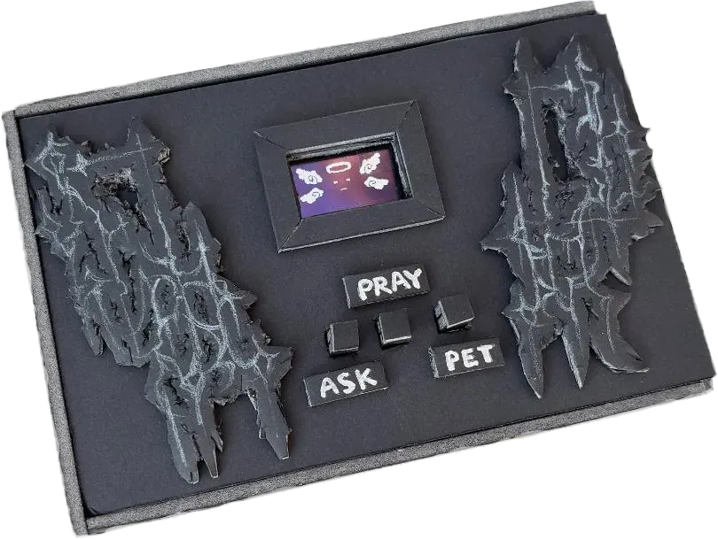
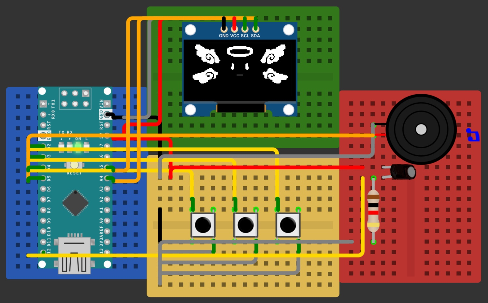

# e-Angel  

by Lilli (https://github.com/foreverearthmover) and Valeria (https://github.com/c-valeria-mj)



### Navigation

```
/docs
  documentation.pdf              // our documentation text
/code
  /demos
    demo1.1.ino                  // first demo file (updated)
    demo_tilt.ino                // tilt function added
    /animatedAngel            
      animatedAngel.ino            // uses bitmap animations
      animatedAngel_buzzer.ino     // uses buzzer sounds
      animatedAngel_Demon.ino      // adds Demon state
      bitmaps.h                    // bitmaps needed
  /final_code
    ino_code.ino                 // final code
    bitmaps.h                    // final bitmap file
/media                         // media referred to in documentation
  circuits/                      
  demo_video/                    // includes demo video
  images/
    /enclosure
  videos/
README.md
```

| Item                               | Description                                                              |
|------------------------------------|--------------------------------------------------------------------------|
| [docs](./docs)                     | Documentation for our digital pet.                                       |
| [code](./code)                     | Code for the tamagotchi is here.                                         | 
| [media](./media)                   | All photos and videos as well as bitmaps used can be found here.         |

### Project overview  
In this project we worked on a pocket guardian angel in the form of a tamagotchi that reacts to button presses and enters different states based on interactions with the user.  

### Dependencies  
Open your Arduino IDE and go to Sketch > Include Library > Manage Libraries, install these:  
Adafruit_GFX Library  
Adafruit_SSD1306 Library  
CuteBuzzerSounds Library

#### Hardware list  
- Arduino Nano
- 4x Mini Breadboards
- Jumper Wires
- 1x 10K Resistor
- 1x Tilt Switch
- 3x Buttons
- 0.96" I2C OLED Display (SSD1306 Chip)
- Passive Buzzer
- USB to Mini-USB cable for Nano

#### Wiring diagrams  


#### Usage  
Download "ino_code.ino" and "bitmaps.h" from the [final_code](./code/final_code) folder and upload both files in your Arduino IDE. The files must be in the same directory.
